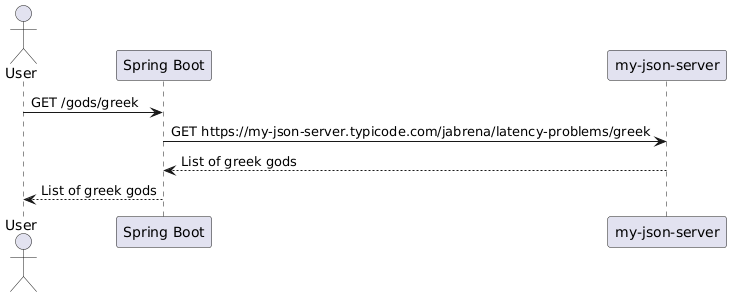

# Spring Boot Integration Testing

This repository show the advantages to add integrations tests in favor of Unit tests with Mocks.

## Design



## How to build in local

```bash
sdk env install
./mvnw clean verify
./mvnw dependency:tree
./mvnw clean spring-boot:run
./mvnw clean spring-boot:run -Dspring-boot.run.profiles=ko
curl "http://localhost:8080/gods/greek"

./mvnw versions:display-dependency-updates
./mvnw versions:display-plugin-updates

jwebserver -p 8080 -d "$(pwd)/docs/"
```

## References

- https://www.researchgate.net/publication/335809902_Role_of_Testing_in_Software_Development_Life_Cycle
- https://www.functionize.com/blog/how-nasa-does-software-testing-and-qa
- https://martinfowler.com/tags/testing.html
- https://martinfowler.com/tags/test%20categories.html
- https://martinfowler.com/tags/extreme%20programming.html
- https://martinfowler.com/bliki/IntegrationTest.html
- https://microsoft.github.io/code-with-engineering-playbook/automated-testing/unit-testing/mocking/
- https://kentcdodds.com/blog/the-testing-trophy-and-testing-classifications
- https://engineering.atspotify.com/2018/01/testing-of-microservices/
- https://x.com/randal_olson/status/799707563860299776
- https://x.com/erinfranmc/status/1148986961207730176
- https://kentcdodds.com/blog/write-tests
- https://plantuml.com/es/
- https://real-world-plantuml.com/
- https://testing.googleblog.com/
- https://revealjs.com/
- https://revealjs.com/installation/#full-setup


Powered by [Cursor](https://www.cursor.com/)